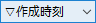
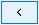
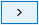
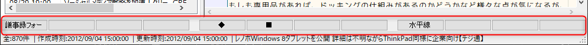
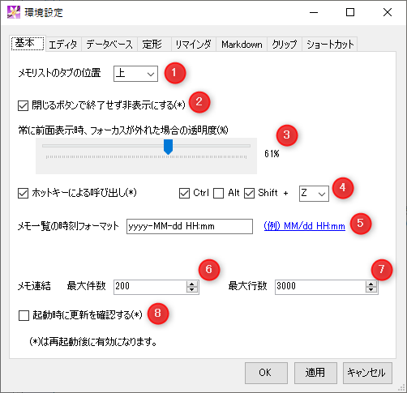
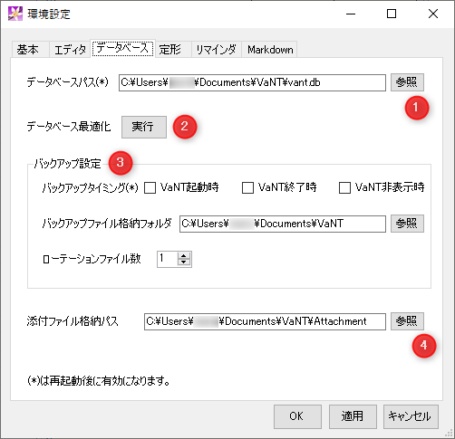

VaNT Document
=================================
 VaNT ( *Vanilla Note Taker* )


## 1．VaNTについて

VaNTはVanilla Note Takerの略で、Windows10上で動作する、テキストベースのメモ帳ソフトです。\
インターフェイスはXTMemoの影響を受けており、メモのの抽出機能などはhowmの影響を受けています。\
完全にローカルで動作するため、インターネットに接続できないセキュアな環境でも問題なく利用できます。\
絞込み、前文検索（AND、OR、NOT）が可能で、すばやく目的のメモを参照することができます。\
また、重要な財産であるメモデータの消失を防ぐため、データのバックアップ機能にも重点を置いています。\
メモデータはSQLiteのデータベースファイル1つだけなので、クラウドストレージを利用することで、複数のWindows端末でデータを同期することもできます。\
VaNTは個人的に仕事で使うために開発しましたが、非常に仕事の生産性が上がっているため、一般に公開させていただくことにしました。
本ソフトはGithub上にソースをアップしていますが、現状プライベートリポジトリとしています。将来的に使っていただけるユーザーが増えたり、私が開発を継続できなくなるなどの状況になれば、パブリックにしてオープンソースにすることも検討したいと思います。


## 2．動作環境

以下の環境を推奨します。申し訳ありませんが、テスト環境がないため現状64bit専用です。

|項目|推奨・前提|
|----|-----|
|OS|Microsoft Windows 10（Windows7でも動作すると思います）|
|メモリ|2GB以上|
|その他|.NET Framework v4.6以上|

## 3. インストール

[https://github.com/forestail/VaNT-Release/releases](https://github.com/forestail/VaNT-Release/releases)
から最新のインストーラをダウンロードし、`setup.exe`を実行してください。


## 4．使い方・機能概要

### 4.1．起動
初めて起動すると、ユーザーのドキュメントフォルダに`VaNT`というフォルダを作り、そこにデータベースファイルを自動作成します。既に別の環境でVaNTを使っていた場合は、環境設定のデータベースタブの設定で、既存のデータベースファイルのパスを指定し、VaNTを再起動してください。\
デフォルトでは、データベースファイルと同じ場所に、`Attachment`フォルダが作成され、エディタ上に添付した画像やファイルを格納します。

### 4.2．画面構成


起動すると、左側に空のメモリスト、右側にメモ表示/編集領域が表示されています。標準はこれらが左右に分かれている状態ですが、上下に分割するように変更もできます。XTMemoやhowmに慣れている方は、こちらの方が親しみやすいかもしれません。ただ、最近はワイド型のモニタが多いので、左右分割の方が画面を有効に使えます。\
上部にはソート条件選択フォーム、検索フォーム、各種機能のボタンがあります。\
メモリストには最初「すべて」というタブのみが表示されています。後述する絞込みや検索を行うと、このタブが増えます。\
エディタ部分はメモリストで選択したメモが表示され、編集を行う領域です。

以下はXTmemoのような構成にしたイメージです。


### 4.3．新規メモ作成


メモを作成するには、「メモ」メニューから「新規作成」を選択するか、Ctrl+Nを押してください。メモリストに新しいメモが追加されて、編集できる状態になります。\
エディタ部分にメモを入力すると、自動的に1行目をタイトルと認識してメモリストが更新されます。先頭が空行で始まる場合は、有効な最初の行がタイトルとして自動認識されます。\
メモ帳アプリとしては当然ですが、ファイル名の命名や保存操作は必要ありません。\
新しいメモを作成していくと、メモリストに作成したメモが追加されていきます。

### 4.4．メモの検索


作成したメモを探すには、絞込み（Filter）と全文検索（Search）の二通りの方法を用意しています。それぞれ特徴があるため、場合によって使い分けることで効率よく目的のメモを探し当てることができます。

#### 4.4.1．絞込み
メモの絞込みは、メモリストの「すべて」タブに表示されているメモを、指定のキーワードが含まれるかでフィルタリングする機能です。上部の検索窓に文字を入力すると、自動的にフィルタリング機能が働き、すべてタブの内容が絞り込まれていきます。
「Filter」ボタンが押下された状態で「検索」ボタンを押下するか、検索窓内にカーソルがある状態でエンターキーを押下すると、メモリストにタブが追加され、フィルタされたメモだけが表示されたメモ一覧が表示されます。このリストを選択することで、当該メモの内容がエディタ部分に表示されます。

#### 4.4.2．全文検索
メモの絞込みは指定したキーワードが含まれるメモの一覧を表示するものですが、指定したキーワードがメモのどこに含まれているか、キーワードが含まれる行の内容を一覧で見たい場合もあります。その場合は「Search」ボタンが押下された状態で「検索」ボタンを押下することにより、全文検索結果のタブがメモリストに追加され、指定したキーワードを含む行がすべて一覧で表示されます。この結果を選択すると、当該メモの当該行がエディタ部分に表示されます。

### 4.5．メモの連結
メモ一覧に表示されているメモは、すべてを結合して１枚のメモとして表示することもできます。結合したいメモ一覧がメモリストに表示されている状態で、上部の結合ボタンを押下すると、メモリストに表示されているメモをすべて結合した内容がエディタ部分に表示されます。ただし、結合表示中はメモを編集することはできません。絞込みや全文検索を行ったメモをすべて一気に確認したい場合に利用できます。

### 4.6．予定リスト
予定リストとTODOリストはhowmのトップページに自動抽出されるものと同等のものです。予定リストボタンを押下すると、メモの中から`[YYYY-MM-DD]@～`と`[YYYY-MM-DD]!～`という文字列を抽出して日付順に並べたものがメモリストに表示されます。リストを選択するとその文字列が含まれるメモがエディタ部分に表示されます。
予定リストは基本的に当日以降の日付の予定と締め切りを抽出しますが、設定により何日前からのものを表示するかを変更できます。

### 4.7．TODOリスト
TODOリストはhowmの浮沈式TODOを再現したものです。浮沈のアルゴリズムはかなり適当なので、howmのソート順と完全に同じにはなりませんが、覚書(+)、TODO(+)、締め切り(!)、保留(~)がある程度重要な順に並べられてメモリストに表示されます。これらの記述はhowmと同じにしてあります。


## 5．機能詳細

### 5.1．メニュー

メニューの各項目の機能・動作は以下の通りです。

#### ◆メモ
|メニュー|内容|
|---|---|
|新規作成|メモを新規作成します。`Ctrl+N`のショートカットが利用できます。|
|削除|メモリストで選択したメモを削除します。一度削除したメモは元に戻せないので注意してください。<br/>基本的にメモは削除せずにどんどん貯めこんでいくことをお勧めします。|
|VaNTを完全に終了|VaNTアプリを終了します。通常はウィンドウ右上の[x]ボタンを押すと終了しますが、[x]ボタン押下時にVaNTを終了せずにタスクトレイに格納する設定の場合、アプリを完全に終了するには、この機能を使ってください。|

#### ◆編集
|メニュー|内容|
|---|---|
|やり直し|エディター上の編集をやり直します。（UNDO）|
|やり直しのやり直し|エディター上の編集のやり直しを取り消して元に戻します。（REDO）|
|検索|エディタ上のテキストを検索します。|
|置換|エディタ上のテキストを置換します。|

#### ◆設定
|メニュー|内容|
|---|---|
|画面スタイル|メモリストペインとエディタペインの配置を、「左右」分割、「上下」分割のいずれかに変更できます。|
|環境設定|環境設定ダイアログを表示します。|
|常に全面表示|Windows上で、VaNTを常に全面に表示する状態になります。|

#### ◆ヘルプ
|メニュー|内容|
|---|---|
|VaNTについて|バージョン情報等を表示します。|


### 5.2．ボタン


|ボタン|内容|
|---------------------------|--------------------------------------------------------|
|  |メモリストのソート順を、作成時刻の降順 or 更新時刻の降順に切り替えます。|
||メモ検索のモードを全文検索モード(※1)にします。|
||メモ検索のモードをフィルタモード(※2)にします。|
|  |メモ検索の文字列を入力します。スペース区切りでAND検索になります。フィルタモード選択時は、入力と同時に動的にメモリストが絞り込まれます。|
||メモ検索を実行します。検索結果は、メモリストペインに新規タブとして追加されます。|
|  |メモ表示の履歴上、一つ前のメモに移動します。|
||メモ表示の履歴上、一つ後のメモに移動します。|
||howm形式の「予定(@)」の「締め切り(!)」を抽出してメモリストペインに表示します。表示される範囲は環境設定画面で変更できます。|
|  |howm形式の「覚書(-)」「TODO(+)」「締め切り(!)」「保留(~)」を抽出してメモリストペインに表示します。表示される順序はhowmライクになっています。詳細は環境設定画面で変更できます。|
|    |現在表示しているメモをMarkdownとみなし、HTML表示します。|
|   |現在メモリストペインに表示されているメモの内容を全て結合して一つのテキストとしてエディタ上に表示します。もう一度押すと解除し元の表示に戻ります。多すぎるメモを結合するとパフォーマンスに影響が出るため、環境設定画面で上限を設定できます。|
||エディタペインを最大化（メモリストペインを非表示に）します。もう一度押すと元に戻します。|


### 5.3．メモリスト

#### ◆すべて
初期状態でメモリストペインには「すべて」というタブだけがあり、ここに全てのメモ一覧が表示されます。ただし、環境設定画面で設定する表示上限の件数より古いものは表示されません。
メモリストには、「作成時刻」「タイトル」「更新時刻」の３つのカラムがあり、表示幅をそれぞれ変更できます。
行を選択すると、当該メモの内容をエディタに表示します。

#### ◆フィルタ系タブ
フィルタモードで検索を行うと、背景が白いフィルタ系の検索結果タブが追加されます。
これは前述の「すべて」タブと同様、１つの行が１つのメモに対応します。
xtmemoと同じように、一度検索してタブ化しておくと、後からすぐにそのリストを表示できます。
フィルタ系タブの名前は「[F]検索語句」の形式となります。

#### ◆全文検索系タブ
全文検索モードで検索を行うと、背景が黄色い全文検索系の検索結果タブが追加されます。表示項目も「検索結果」列のみになります。
これは、１つの行がメモの該当行に対応します。そのため、メモリストの行を選択するとメモの中で検索キーワードが使われている行にカーソルを合わせた状態でエディタ上に表示します。
全文検索系タブの名前は、「[S]検索語句」の形式となります。

#### ◆スケジュールタブ
スケジュールボタン押下時に追加されます。
スケジュールタブの名前は「@」となります。
詳細は後述の「浮沈式TODO詳細」参照。

#### ◆TODOタブ
TODOボタン押下時に追加されます。
TODOタブの名前は「✓」となります。
詳細は後述の「浮沈式TODO詳細」参照。

#### ◆全般
「すべて」タブ以外のタブは、タブ部分を右クリックすることで、以下のメニューが表示されます。それぞれの機能は以下の通りです。

|メニュー|内容|
|---|---|
|削除|タブを削除します。`Ctrl+W`のショートカットが利用できます。|
|保護|タブが保護状態でない場合に表示され、VaNTアプリを終了してもタブが保持されるようにロックします。|
|保護解除|タブが保護状態の場合に表示され、保護状態を解除します。|


### 5.4．検索詳細
検索は、フィルタモード、全文検索モードでそれぞれ以下の挙動になります。

#### ◆フィルタモード
１つのメモの中に、スペースで区切られた検索語句を全て含むものがフィルタされて、メモ一覧に表示されます。
検索語句を入力すると動的に「すべて」タブのメモが絞り込まれるので、一時的な検索に便利です。
検索結果を保持しておきたい場合は、検索語句を入力してエンターキーを押すか、検索ボタンを押下してください。

#### ◆全文検索モード
１つのメモの中に、スペースで区切られた検索語句を全て含むものに絞り込んだ上で、検索した語句のいずれかを含む行を全てメモリストに表示します。


### 5.5．浮沈式TODO詳細
howmの特徴的な機能である「浮沈式TODO」を簡易的に実装しています。
メモの中に以下の形式で記述されたものを抽出します。

```
[YYYY-MM-DD]{種別文字列} 内容
```
例）[2020-01-01]@ 雑煮を作る

howmに倣い、以下の種類を用意しています。

|種類|種別文字列|概要|
|---|---|---|
|予定|@||
|覚書|-|・指定日に浮き上がり、以後は徐々に沈む。<br/>・指定日までは底に潜伏。|
|TODO|+|・指定日から徐々に浮き上がってくる。<br/>・指定日までは底に潜伏。|
|締め切り|!|・指定日が近づくと浮き上がってくる。<br/>・指定日以降は、一番上に浮きっぱなし。|
|保留|~|・指定日から浮き沈みを繰り返す。<br/>・指定日までは底に潜伏。|


### 5.6．エディタ
メモはUTF-8で管理されています。

エディタ上にメモを書くと、自動的に１行目がメモのタイトルとして認識され、メモリストに表示されます。

入力を簡単にするため、エディタ上で右クリックするとhowmの浮沈式TODO形式の挿入と、タイムスタンプ（Ctrl+Tで入力）を挿入するヘルパー機能があります。 \
:new: タイムスタンプの形式は設定画面で変更できるので、お好みの形式を設定しください。

:new: 右クリックメニューからメモの複製ができます。

エディタ上の文字列を検索・置換する場合は、編集メニューから「検索」「置換」を選択するか、`Ctrl+Shift+F`、`Ctrl+Shift+R`のショートカットが使えます。

エディタ内の文字列を素早くmigemo検索したい場合は、`Ctrl+/`で検索用の小窓が表示されるので、ローマ字を入力することでインクリメンタルサーチされます。小窓を消すには`Esc`キーを押してください。


### 5.7．アクションロック
特定の文字列を入力すると、その文字の上でエンターキーやマウスクリックをすることで、特殊な機能を発動することができます。これをhowmに倣いアクションロックと呼んでいます。

アクションロックには、以下の種類があります。

|アクションロック文字列|操作|動作|
|---|---|---|
|http(s)://～|ダブルクリック|URLを既定のブラウザで開く。|
|Windows上のファイルパス（画像以外）|ダブルクリック|ファイルを既定のアプリケーションで開く。|
|Windows上のファイルパス（画像）|クリック|画像をプレビューする。|
|・ / ✓|エンター/ダブルクリック|左記の左右の文字列をトグル切り替え。|
|□ / ■|エンター/ダブルクリック|左記の左右の文字列をトグル切り替え。|
|◇ / ◆|エンター/ダブルクリック|左記の左右の文字列をトグル切り替え。|
|>>> 文字列|ダブルクリック|文字列での全文検索タブに遷移。本文中に「<<< 文字列」があるメモが存在する場合は、そこに遷移する。|
|[[文字列]]|ダブルクリック|同上。|


### 5.8．リンク
メモの中にURLを書くと、アンダーラインが引かれアクションロックが設定されます。

URLの部分をダブルクリックをすると既定のブラウザで開こうとします。

このとき、実際に開くかどうかを確認するダイアログを出すか否かを環境設定で変更できます。

### 5.9．ファイル添付
Windowsのエクスプローラ等からファイルをドラッグ＆ドロップすると、以下のようなファイルをVaNTの「添付ファイル格納パス」内にコピーし、そのパスを表示するか、元の格納場所のパスを表示するかを選択するダイアログが表示されます。
一時的なファイルや、ネットワーク上のファイルを保存しておきたい場合は、添付ファイルフォルダにコピーすることをおすすめします。


メモ内に添付されたファイルは画像以外と画像で挙動が異なります。
画像以外のファイルの場合、表示されているパスをダブルクリックすると、そのファイルの拡張子に関連づいているアプリケーションで開きます。

画像の場合は次項目を参照してください。

:new: スクリーンショットなど、クリップボードに画像が格納されている状態で、エディタ上でCtrl+Vを押すと、添付ファイル格納パスにその画像を保存します。保存する画像の形式は、設定画面でPNG、JPEG、Bitmap、Gif、Tiff、WMFから選択できます。 \
ただし、WMFを選択した場合は次項目の画像プレビューができないため、通常のファイルと同様WMFを開く既定のアプリケーションで開かれます。

### 5.10．画像プレビュー
ファイル添付を行った際、拡張子が画像ファイルだった場合、パスをマウスでクリックすると画像のプレビューウィンドウを表示します。

VaNTのメモは基本的にテキストベースですが、複雑な表などは画像として画面キャプチャして添付しておくことで、すぐに参照することができます。


### 5.11. 定型文
ウィンドウ下部に定型文ボタンを表示できます。このボタンはF1～F12のファンクションキーに対応しています。

通常のファンクションキー12個と、Shiftキーを押しながらのファンクションキー12個で、計24個の定型文を登録できます。



### 5.12. 数式計算機能
エディタ上の数式部分を選択し、マウスの右クリックをすると計算結果を１行目に表示します。 \
この計算結果をクリックすると、エディタ内に計算結果を挿入されます。


:new: 複数行を選択して右クリックすると、数式とみなされた行の計算結果を全て足しあげた合計を表示します。


## 6．環境設定（T.B.D.）
### 6.1．環境設定 ＞ 一般


### 6.2．環境設定 ＞ エディタ


### 6.3．環境設定 ＞ データベース


### 6.5．環境設定 ＞ 定型


### 6.5．環境設定 ＞ リマインダ


## 7．ショートカット一覧

### ◆全体
|ショートカットキー|動作|
|---|---|
|Ctrl+N|新規メモ作成|
|Ctrl+S|全文検索モードにして検索キーワード入力受付状態にする|
|Ctrl+F|フィルタモードにして検索キーワード入力受付状態にする|
|Ctrl+Shift+F|現在表示しているメモ内を検索するダイアログを表示|
|Ctrl+Shift+R|現在表示しているメモ内を置換するダイアログを表示|
|Alt+←|メモリストとエディタの境界を左に移動|
|Alt+→|メモリストとエディタの境界を右に移動|
|Ctrl+Q|VaNTを終了、またはタスクトレイに格納|


### ◆メモリスト
|ショートカットキー|動作|
|---|---|
|Ctrl+W|選択中のメモリストタブを閉じる|


### ◆エディタ
|ショートカットキー|動作|
|---|---|
|Ctrl+/ | 現在表示中のエディタ内容をmigemoでインクリメンタルサーチ<br/>Enterで次のヒット箇所に遷移<br/>Escで終了|


## 8．謝辞
Migemoを発案された高林哲さん、C/Migemoを開発され簡単に利用できるようにしてくださった村岡太郎さん、素晴らしいエディタコントロールであるAzukiを開発されたSuguru YAMAMOTOさんに感謝いたします。

また、howmという唯一無二のEmacs環境を作成されたHIRAOKA Kazuyukiさん、使いやすいChangeLog形式のメモソフトXTMemoを作成されたtowofuさんに深く敬意を表したいと思います。

## 9. 更新履歴
|公開日|Ver.|内容|
|---|---|---|
|2020/02/11|v0.6.6|エディタ内検索でF3/Shift+F3のショートカットに対応。<br/>不具合修正。|
|2020/02/10|v0.6.5|メモの複製機能追加。<br/>不具合修正。|
|2020/02/10|v0.6.4|不具合修正。|
|2020/02/09|v0.6.3|クリップボードの画像をエディタに貼り付けられるようにした。<br/>戻る、進む時にカーソル行も保存、復元するようにした。<br/>数式計算機能で複数行計算に対応。<br/>タイムスタンプのフォーマットを設定で変更できるようにした。|
|2020/02/02|v0.6.2|設定した日付のフォーマットが更新時刻の表示に反映されない問題修正。|
|2020/02/02|v0.6.1|エディタ部分のパフォーマンスを改善。<br/>（特に、HDDにデータベースファイルを配置している場合、劇的に速くなります。）|
|2020/02/01|v0.6.0|初回起動時のデフォルトデータベースパスを、ユーザーのドキュメントフォルダに変更。<br/>初回起動時にエラーが発生する問題を修正。|
|2020/02/01|v0.5.2|数式計算機能追加|
|2020/01/31|v0.5.1|ホットキー呼び出しで全面にしてもカーソルが背面のアプリに残る場合がある問題修正|
|2020/01/28|v0.5.0|新規公開|