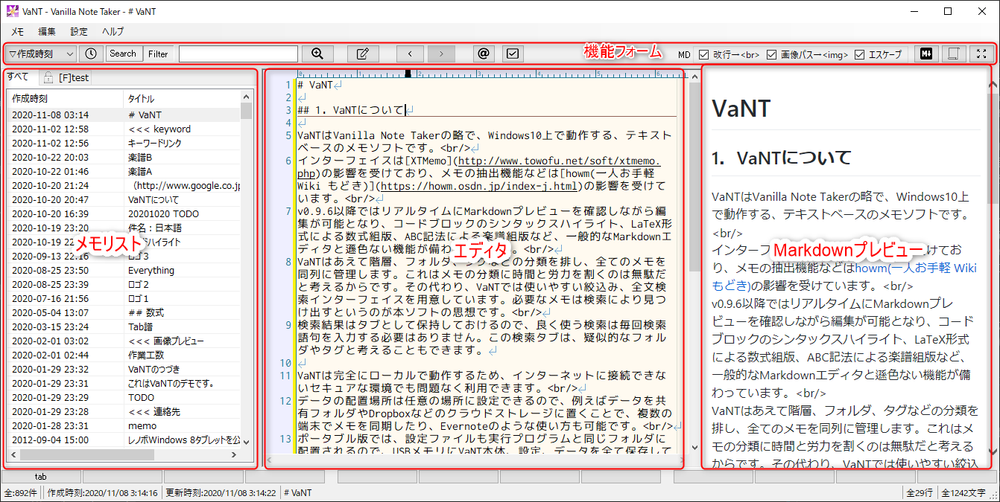

VaNT Document
=================================
 VaNT ( *Vanilla Note Taker* )

## 1．VaNTについて

VaNTはVanilla Note Takerの略で、Windows10上で動作する、テキストベースのメモ帳ソフトです。\
インターフェイスはXTMemoの影響を受けており、メモのの抽出機能などはhowmの影響を受けています。\
完全にローカルで動作するため、インターネットに接続できないセキュアな環境でも問題なく利用できます。\
絞込み、前文検索（AND、OR、NOT）が可能で、すばやく目的のメモを参照することができます。\
また、重要な財産であるメモデータの消失を防ぐため、データのバックアップ機能にも重点を置いています。\
メモデータはSQLiteのデータベースファイル1つだけなので、クラウドストレージを利用することで、複数のWindows端末でデータを同期することもできます。\
VaNTは個人的に仕事で使うために開発しましたが、非常に仕事の生産性が上がっているため、一般に公開させていただくことにしました。
本ソフトはGithub上にソースをアップしていますが、現状プライベートリポジトリとしています。将来的に使っていただけるユーザーが増えたり、私が開発を継続できなくなるなどの状況になれば、パブリックにしてオープンソースにすることも検討したいと思います。

## 2．動作環境

以下の環境を推奨します。申し訳ありませんが、テスト環境がないため現状64bit専用です。

|項目|推奨・前提|
|----|-----|
|OS|Microsoft Windows 10（Windows7でも動作すると思います）|
|メモリ|2GB以上|
|その他|.NET Framework v4.6以上|

## 3. インストール

releasesタブから最新のインストーラをダウンロードし、`setup.exe`を実行してください。

## 4．使い方・機能概要

### 4.1．起動
初めて起動すると、データベースを選択するダイアログが表示されます。既に別の環境でVaNTを使っていた場合はデータベースファイルを適当なフォルダに配置し、そのパスを指定してください。\
これまでVaNTを使ったことがない場合は、データベース選択ダイアログで、データベースファイルを保存するフォルダと、データベースファイル名を指定してください。指定したファイルが存在しなければ新規作成されます。データベース選択ダイアログをキャンセルで閉じた場合は、vant.exeと同じフォルダに「vant.db」というデータベースファイルが作成されます。

### 4.2．画面構成

起動すると、左側に空のメモリスト、右側にメモ表示/編集領域が表示されています。標準はこれらが左右に分かれている状態ですが、上下に分割するように変更もできます。XTMemoやhowmに慣れている方は、こちらの方が親しみやすいかもしれません。ただ、最近はワイド型のモニタが多いので、左右分割の方が画面を有効に使えます。\
上部にはソート条件選択フォーム、検索フォーム、各種機能のボタンがあります。\
メモリストには最初「すべて」というタブのみが表示されています。後述する絞込みや検索を行うと、このタブが増えます。\
エディタ部分はメモリストで選択したメモが表示され、編集を行う領域です。

### 4.3．新規メモ作成

メモを作成するには、「メモ」メニューから「新規作成」を選択するか、Ctrl+Nを押してください。メモリストに新しいメモが追加されて、編集できる状態になります。\
エディタ部分にメモを入力すると、自動的に1行目をタイトルと認識してメモリストが更新されます。先頭が空行で始まる場合は、有効な最初の行がタイトルとして自動認識されます。\
メモ帳アプリとしては当然ですが、ファイル名の命名や保存操作は必要ありません。\
新しいメモを作成していくと、メモリストに作成したメモが追加されていきます。

### 4.4．メモの検索

作成したメモを探すには、絞込み（Filter）と全文検索（Search）の二通りの方法を用意しています。それぞれ特徴があるため、場合によって使い分けることで効率よく目的のメモを探し当てることができます。

#### 4.4.1．絞込み
メモの絞込みは、メモリストの「すべて」タブに表示されているメモを、指定のキーワードが含まれるかでフィルタリングする機能です。上部の検索窓に文字を入力すると、自動的にフィルタリング機能が働き、すべてタブの内容が絞り込まれていきます。
「Filter」ボタンが押下された状態で「検索」ボタンを押下するか、検索窓内にカーソルがある状態でエンターキーを押下すると、メモリストにタブが追加され、フィルタされたメモだけが表示されたメモ一覧が表示されます。このリストを選択することで、当該メモの内容がエディタ部分に表示されます。

#### 4.4.2．全文検索
メモの絞込みは指定したキーワードが含まれるメモの一覧を表示するものですが、指定したキーワードがメモのどこに含まれているか、キーワードが含まれる行の内容を一覧で見たい場合もあります。その場合は「Search」ボタンが押下された状態で「検索」ボタンを押下することにより、全文検索結果のタブがメモリストに追加され、指定したキーワードを含む行がすべて一覧で表示されます。この結果を選択すると、当該メモの当該行がエディタ部分に表示されます。

### 4.5．メモの連結
メモ一覧に表示されているメモは、すべてを結合して１枚のメモとして表示することもできます。結合したいメモ一覧がメモリストに表示されている状態で、上部の結合ボタンを押下すると、メモリストに表示されているメモをすべて結合した内容がエディタ部分に表示されます。ただし、結合表示中はメモを編集することはできません。絞込みや全文検索を行ったメモをすべて一気に確認したい場合に利用できます。

### 4.6．予定リスト
予定リストとTODOリストはhowmのトップページに自動抽出されるものと同等のものです。予定リストボタンを押下すると、メモの中から`[YYYY-MM-DD]@～`と`[YYYY-MM-DD]!～`という文字列を抽出して日付順に並べたものがメモリストに表示されます。リストを選択するとその文字列が含まれるメモがエディタ部分に表示されます。
予定リストは基本的に当日以降の日付の予定と締め切りを抽出しますが、設定により何日前からのものを表示するかを変更できます。

### 4.7．TODOリスト
TODOリストはhowmの浮沈式TODOを再現したものです。浮沈のアルゴリズムはかなり適当なので、howmのソート順と完全に同じにはなりませんが、覚書(+)、TODO(+)、締め切り(!)、保留(~)がある程度重要な順に並べられてメモリストに表示されます。これらの記述はhowmと同じにしてあります。

## 5．機能詳細

### 5.1．メニュー

メニューの各項目の機能・動作は以下の通りです。

#### ◆メモ
|メニュー|内容|
|---|---|
|新規作成|メモを新規作成します。Ctrl+Nのショートカットが利用できます。|
|削除|メモリストで選択したメモを削除します。一度削除したメモは元に戻せないので注意してください。 基本的にメモは削除せずにどんどん貯めこんでいくことをお勧めします。|
|VaNTを完全に終了|VaNTアプリを終了します。通常はウィンドウ右上の[x]ボタンを押すと終了しますが、[x]ボタン押下時にVaNTを終了せずにタスクトレイに格納する設定の場合、アプリを完全に終了するには、この機能を使ってください。|

#### ◆編集
|メニュー|内容|
|---|---|
|やり直し|エディター上の編集をやり直します。（UNDO）|
|やり直しのやり直し|エディター上の編集のやり直しを取り消して元に戻します。（REDO）|
|検索|エディタ上のテキストを検索します。|
|置換|エディタ上のテキストを置換します。|

#### ◆設定
|メニュー|内容|
|---|---|
|画面スタイル|メモリストペインとエディタペインの配置を、「左右」分割、「上下」分割のいずれかに変更できます。|
|環境設定|環境設定ダイアログを表示します。|
|常に全面表示|Windows上で、VaNTを常に全面に表示する状態になります。|

#### ◆ヘルプ
|メニュー|内容|
|---|---|
|VaNTについて|バージョン情報等を表示します。|

### 5.2．ボタン

|ボタン|内容|
|---------------------------|--------------------------------------------------------|
|  |メモリストのソート順を、作成時刻の降順 or 更新時刻の降順に切り替えます。|
||メモ検索のモードを全文検索モード(※1)にします。|
||メモ検索のモードをフィルタモード(※2)にします。|
|  |メモ検索の文字列を入力します。スペース区切りでAND検索になります。フィルタモード選択時は、入力と同時に動的にメモリストが絞り込まれます。|
||メモ検索を実行します。検索結果は、メモリストペインに新規タブとして追加されます。|
|  |メモ表示の履歴上、一つ前のメモに移動します。|
||メモ表示の履歴上、一つ後のメモに移動します。|
||howm形式の「予定(@)」の「締め切り(!)」を抽出してメモリストペインに表示します。表示される範囲は環境設定画面で変更できます。|
|  |howm形式の「覚書(-)」「TODO(+)」「締め切り(!)」「保留(~)」を抽出してメモリストペインに表示します。表示される順序はhowmライクになっています。詳細は環境設定画面で変更できます。|
|    |現在表示しているメモをMarkdownとみなし、HTML表示します。|
|   |現在メモリストペインに表示されているメモの内容を全て結合して一つのテキストとしてエディタ上に表示します。もう一度押すと解除し元の表示に戻ります。多すぎるメモを結合するとパフォーマンスに影響が出るため、環境設定画面で上限を設定できます。|
||エディタペインを最大化（メモリストペインを非表示に）します。もう一度押すと元に戻します。|

### 5.3．メモリスト
### 5.4．検索詳細
### 5.5．浮沈式TODO詳細
### 5.6．エディタ
### 5.7．アクションロック
### 5.8．リンク
### 5.9．ファイル添付
### 5.10．画像プレビュー

## 6．設定
### 6.1．一般

### 6.2．エディタ

### 6.3．データベース

### 6.5．TODOリスト

## 7．ショートカット一覧

## 8．謝辞
