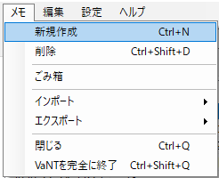
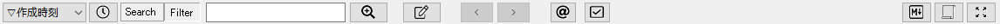
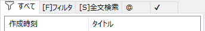

VaNT Document
=================================
 <span style="font-size: 150%;">VaNT ( *Vanilla Note Taker* ) </span>　Version 0.9.6[（更新履歴）](#9-更新履歴)[<font color="red">2020/10/18</font>]


## 1．VaNTについて

VaNTはVanilla Note Takerの略で、Windows10上で動作する、テキストベースのメモソフトです。<br/>
インターフェイスは[XTMemo](http://www.towofu.net/soft/xtmemo.php)の影響を受けており、メモの抽出機能などは[howm(一人お手軽 Wiki もどき)](https://howm.osdn.jp/index-j.html)の影響を受けています。<br/>
v0.9.6以降ではリアルタイムにMarkdownプレビューを確認しながら編集が可能となり、コードブロックのシンタックスハイライト、LaTeX形式による数式組版、ABC記法による楽譜組版など、一般的なMarkdownエディタと遜色ない機能が備わっています。<br/>
VaNTはあえて階層、フォルダ、タグなどの分類を排し、全てのメモを同列に管理します。これはメモの分類に時間と労力を割くのは無駄だと考えるからです。その代わり、VaNTでは使いやすい絞込み、全文検索インターフェイスを用意しています。必要なメモは検索により見つけ出すというのが本ソフトの思想です。<br/>
検索結果はタブとして保持しておけるので、良く使う検索は毎回検索語句を入力する必要はありません。この検索タブは、疑似的なフォルダやタグと考えることもできます。

VaNTは完全にローカルで動作するため、インターネットに接続できないセキュアな環境でも問題なく利用できます。<br/>
データの配置場所は任意の場所に設定できるので、例えばデータを共有フォルダやDropboxなどのクラウドストレージに置くことで、複数の端末でメモを同期したり、Evernoteのような使い方も可能です。<br/>
ポータブル版では、設定ファイルも実行プログラムと同じフォルダに配置されるので、USBメモリにVaNT本体、設定、データを全て保存して持ち歩くこともできます。

本ソフトはGithub上にソースをアップしていますが、現状プライベートリポジトリとしています。<br/>
将来的に使っていただけるユーザーが増えたり、私が開発を継続できなくなるなどの状況になれば、パブリックにしてオープンソースにすることも検討したいと思いますが、しばらくは、自分の欲しい機能を好きなように拡充したいということで、このような形態にさせていただきます。

[※※　解説ページを用意しました　※※](https://vant.hateblo.jp/)（はてなブログに遷移します）

## 2．動作環境

以下の環境を推奨します。申し訳ありませんが、テスト環境がないため現状64bit専用です。

|項目|推奨・前提|
|----|-----|
|OS|Microsoft Windows 10（Windows7でも動作すると思います）※64bit|
|メモリ|2GB以上|
|その他|.NET Framework v4.6以上|


## 3. インストール

### 3.1 インストーラ版
[https://github.com/forestail/VaNT-Release/releases](https://github.com/forestail/VaNT-Release/releases)
から`VaNT_v***.zip`という名称のファイルをダウンロードし、任意の一時フォルダに解凍の上、`setup.exe`を実行してください。


### 3.2 ポータブル版
[https://github.com/forestail/VaNT-Release/releases](https://github.com/forestail/VaNT-Release/releases)
から`VaNT_v***_portable.zip`という名称のファイルをダウンロードし、任意のフォルダに解凍の上、`VaNT.exe`を実行してください。<br/>
ポータブル版の設定ファイルは、VaNT.exeと同じフォルダに`settings.config`というファイルが生成され、そこに書き込まれます。


## 4．使い方・機能概要

### 4.1．起動
初めて起動すると、ユーザーのドキュメントフォルダに`VaNT`というフォルダを作り、そこにデータベースファイルを自動作成します。<br/>
既に別の環境でVaNTを使っていた場合は、環境設定のデータベースタブの設定で、既存のデータベースファイルのパスを指定し、VaNTを再起動してください。<br/>
デフォルトでは、データベースファイルと同じ場所に、`Attachment`フォルダが作成され、エディタ上に添付した画像やファイルを格納します。

### 4.2．画面構成


起動すると、左側に空のメモリスト、その右側にメモ表示/編集領域、一番右にMarkdownプレビュー領域が表示されています。Markdownプレビューが不要であれば、機能フォームの「M↓」ボタンをクリックして閉じてください。<br/>
標準はこれらが左右に分かれている状態ですが、上下に分割するように変更もできます。XTMemoやhowmに慣れている方は、こちらの方が親しみやすいかもしれません。ただ、最近はワイド型のモニタが多いので、左右分割の方が画面を有効に使えます。<br/>
上部にはソート条件選択フォーム、検索フォーム、各種機能のボタンがあります。<br/>
メモリストには最初「すべて」というタブのみが表示されています。後述する絞込みや検索を行うと、このタブが増えます。<br/>
エディタ部分はメモリストで選択したメモが表示され、編集を行う領域です。<br/>
Markdownプレビュー部分は、エディタで編集した内容をMarkdownとしてHTMLにしたものを表示します。リアルタイムプレビューを有効にしておけば、編集内容が即座にプレビューに反映されます。

以下はXTmemoのような構成にしたイメージです。


### 4.3．新規メモ作成


メモを作成するには、「メモ」メニューから「新規作成」を選択するか、ショートカット設定で割り当てたキーを押してください。メモリストに新しいメモが追加されて、編集できる状態になります。<br/>
エディタ部分にメモを入力すると、自動的に1行目をタイトルと認識してメモリストが更新されます。先頭が空行で始まる場合は、有効な最初の行がタイトルとして自動認識されます。<br/>
メモ帳アプリとしては当然ですが、ファイル名の命名や保存操作は必要ありません。<br/>
新しいメモを作成していくと、メモリストに作成したメモが追加されていきます。

### 4.4．メモの検索


作成したメモを探すには、絞込み（Filter）と全文検索（Search）の二通りの方法を用意しています。それぞれ特徴があるため、場合によって使い分けることで効率よく目的のメモを探し当てることができます。

#### 4.4.1．絞込み
メモの絞込みは、メモリストの「すべて」タブに表示されているメモを、指定のキーワードが含まれるかでフィルタリングする機能です。

上部の検索窓に文字を入力すると、自動的にフィルタリング機能が働き、「すべて」タブの内容が絞り込まれていきます。

「Filter」ボタンが押下された状態で「検索」ボタンを押下するか、検索窓内にカーソルがある状態でエンターキーを押下すると、メモリストにタブが追加され、フィルタされたメモだけが表示されたメモ一覧が表示されます。<br/>
このリストを選択することで、当該メモの内容がエディタ部分に表示されます。

#### 4.4.2．全文検索
メモの絞込みは指定したキーワードが含まれるメモの一覧を表示するものですが、指定したキーワードがメモのどこに含まれているか、キーワードが含まれる行の内容を一覧で見たい場合もあります。<br/>
その場合は「Search」ボタンが押下された状態で「検索」ボタンを押下することにより、全文検索結果のタブがメモリストに追加され、指定したキーワードを含む行がすべて一覧で表示されます。<br/>
この結果を選択すると、当該メモの当該行がエディタ部分に表示されます。

### 4.5．メモの連結
メモ一覧に表示されているメモは、すべてを結合して１枚のメモとして表示することもできます。<br/>
結合したいメモ一覧がメモリストに表示されている状態で、上部の結合ボタンを押下すると、メモリストに表示されているメモをすべて結合した内容がエディタ部分に表示されます。<br/>
ただし、結合表示中はメモを編集することはできません。絞込みや全文検索を行ったメモをすべて一気に確認したい場合に利用できます。

### 4.6．予定リスト
予定リストとTODOリストはhowmのトップページに自動抽出されるものと同等のものです。<br/>
予定リストボタンを押下すると、メモの中から`[YYYY-MM-DD]@～`と`[YYYY-MM-DD]!～`という文字列を抽出して日付順に並べたものがメモリストに表示されます。リストを選択するとその文字列が含まれるメモがエディタ部分に表示されます。<br/>
予定リストは基本的に当日以降の日付の予定と締め切りを抽出しますが、設定により何日前からのものを表示するかを変更できます。

### 4.7．TODOリスト
TODOリストはhowmの浮沈式TODOを再現したものです。<br/>
浮沈のアルゴリズムはかなり適当なので、howmのソート順と完全に同じにはなりませんが、覚書(+)、TODO(+)、締め切り(!)、保留(~)がある程度重要な順に並べられてメモリストに表示されます。これらの記述はhowmと同じにしてあります。


## 5．機能詳細

### 5.1．メニュー

メニューの各項目の機能・動作は以下の通りです。

#### ◆メモ
|<nobr>メニュー</nobr>|内容|
|---|---|
|新規作成|メモを新規作成します。|
|削除|メモリストで選択したメモを削除します。一度削除したメモは元に戻せないので注意してください。<br/>基本的にメモは削除せずにどんどん貯めこんでいくことをお勧めします。|
|インポート|CSV形式(UTF-8)、XTmemo形式(Shift_JIS)、ChangeLog形式(Shift_JIS)のテキストデータをインポートできます。|
|エクスポート|CSV形式(UTF-8)、XTmemo形式(UTF-8)、ChangeLog形式(UTF-8)のテキストデータをエクスポートできます。|
|閉じる|VaNT画面を閉じます。終了時にタスクトレイに格納する設定の場合は、完全に終了せずタスクトレイに格納されます。タスクトレイに格納する設定ではない場合は、完全に終了します。|
|VaNTを完全に終了|VaNTアプリを終了します。通常はウィンドウ右上の[x]ボタンを押すと終了しますが、[x]ボタン押下時にVaNTを終了せずにタスクトレイに格納する設定の場合、アプリを完全に終了するには、この機能を使ってください。|

#### ◆編集
|<nobr>メニュー</nobr>|内容|
|---|---|
|やり直し|エディター上の編集をやり直します。（UNDO）|
|やり直しのやり直し|エディター上の編集のやり直しを取り消して元に戻します。（REDO）|
|検索|エディタ上のテキストを検索します。|
|置換|エディタ上のテキストを置換します。|
|migemo検索|エディタ内をmigemoによるローマ字検索します。|


#### ◆設定
|<nobr>メニュー</nobr>|内容|
|---|---|
|常に全面表示|Windows上で、VaNTを常に全面に表示する状態になります。|
|画面スタイル|メモリストペインとエディタペインの配置を、「左右」分割、「上下」分割のいずれかに変更できます。|
|Markdown|Markdownプレビューに関する設定を変更できます。それぞれトグルになっていて、次の設定を変更できます。<br/>・リアルタイム変換する<br/>・改行を&lt;br&gt;に変換<br/>・画像パスを&lt;img&gt;に変換<br/>・MathJaxによる数式表示<br/>・abcjsによる楽譜表示<br/>・コードハイライト|
|環境設定|環境設定ダイアログを表示します。|


#### ◆ヘルプ
|<nobr>メニュー</nobr>|内容|
|---|---|
|VaNTドキュメント|VaNTのドキュメント（chm形式）を開きます。|
|VaNTについて|バージョン情報等を表示します。|


### 5.2．ボタン

Markdown非表示時：<br/>
 <br/>
Markdown表示時：<br/>


|ボタン|内容|
|---------------------------|--------------------------------------------------------|
|  |メモリストのソート順を、作成時刻の降順 or 更新時刻の降順に切り替えます。|
||メモ検索のモードを全文検索モード(※1)にします。|
||メモ検索のモードをフィルタモード(※2)にします。|
|  |メモ検索の文字列を入力します。スペース区切りでAND検索になります。フィルタモード選択時は、入力と同時に動的にメモリストが絞り込まれます。|
||メモ検索を実行します。検索結果は、メモリストペインに新規タブとして追加されます。|
|  |メモ表示の履歴上、一つ前のメモに移動します。|
||メモ表示の履歴上、一つ後のメモに移動します。|
||howm形式の「予定(@)」の「締め切り(!)」を抽出してメモリストペインに表示します。表示される範囲は環境設定画面で変更できます。|
|  |howm形式の「覚書(-)」「TODO(+)」「締め切り(!)」「保留(~)」を抽出してメモリストペインに表示します。表示される順序はhowmライクになっています。詳細は環境設定画面で変更できます。|
|    |現在表示しているメモをMarkdownとみなし、HTML表示します。|
|   |現在メモリストペインに表示されているメモの内容を全て結合して一つのテキストとしてエディタ上に表示します。もう一度押すと解除し元の表示に戻ります。多すぎるメモを結合するとパフォーマンスに影響が出るため、環境設定画面で上限を設定できます。|
||エディタペインを最大化（メモリストペインを非表示に）します。もう一度押すと元に戻します。|
||Markdown表示オプション（後述）を変更します。|


### 5.3．メモリスト

#### ◆すべて
 <br/>
初期状態でメモリストペインには「すべて」というタブだけがあり、ここに全てのメモ一覧が表示されます。ただし、環境設定画面で設定する表示上限の件数より古いものは表示されません。<br/>
この表示件数はご自身のPCスペックに合わせて適宜変更してください。リストに表示されていなくても、絞り込みや全文検索の対象にはなります。

メモリストには、「作成時刻」「タイトル」「更新時刻」の３つのカラムがあり、表示幅をそれぞれ変更できます。<br/>
行を選択すると、当該メモの内容をエディタに表示します。

検索ボックスに文字を入力すると、動的にすべてタブの内容をフィルタしますので、タブとして保持する必要のない一時的な検索は検索ボタンを押す必要はありません。すべてタブがフィルタされている場合は以下のようにフィルタアイコンが表示されます。<br/>
 <br/>


#### ◆フィルタ系タブ
 <br/>
フィルタモードで検索を行うと、背景が白いフィルタ系の検索結果タブが追加されます。
これは前述の「すべて」タブと同様、１つの行が１つのメモに対応します。<br/>
xtmemoと同じように、一度検索してタブ化しておくと、後からすぐにそのリストを表示できます。<br/>
フィルタ系タブの名前は`[F]検索語句`の形式となります。

#### ◆全文検索系タブ
 <br/>
全文検索モードで検索を行うと、背景が黄色い全文検索系の検索結果タブが追加されます。表示項目も「検索結果」列のみになります。<br/>
これは、１つの行がメモの該当行に対応します。そのため、メモリストの行を選択するとメモの中で検索キーワードが使われている行にカーソルを合わせた状態でエディタ上に表示します。<br/>
全文検索系タブの名前は、`[S]検索語句`の形式となります。

#### ◆スケジュールタブ
 <br/>
スケジュールボタン押下時に追加されます。<br/>
スケジュールタブの名前は`＠`となります。<br/>
詳細は後述の「浮沈式TODO詳細」参照。

#### ◆TODOタブ
 <br/>
TODOボタン押下時に追加されます。<br/>
TODOタブの名前は`✓`となります。<br/>
詳細は後述の「浮沈式TODO詳細」参照。

#### ◆全般
「すべて」タブ以外のタブは、タブ部分を右クリックすることで、以下のメニューが表示されます。それぞれの機能は以下の通りです。

|<nobr>メニュー</nobr>|内容|
|---|---|
|削除|タブを削除します。|
|保護|タブが保護状態でない場合に表示され、VaNTアプリを終了してもタブが保持されるようにロックします。|
|保護解除|タブが保護状態の場合に表示され、保護状態を解除します。|
|右へ移動 >|右隣りのタブと入れ替えます。|
|< 左へ移動|左隣のタブと入れ替えます。ただし、「すべて」タブより左には移動できません。|
|右端へ移動 >>|タブを右端に移動します。それより右にあるタブは一つずつ左にずれます。|
|<< 左端へ移動|タブを「すべて」タブの右隣に移動します。それより左にあるタブは一つずつ右にずれます。|

タブ部分でマウスのホイールを回転させると順にタブの選択を切り替えて行きます。<br/>
マウスのホイールをクリックすると、そのタブを削除します。


### 5.4．検索詳細
検索は、フィルタモード、全文検索モードでそれぞれ以下の挙動になります。

#### ◆フィルタモード
１つのメモの中に、スペースで区切られた検索語句を全て含むものがフィルタされて、メモ一覧に表示されます。<br/>
検索語句を入力すると動的に「すべて」タブのメモが絞り込まれるので、一時的な検索に便利です。「すべて」タブがフィルタされて表示されている場合は、タブ名の頭にフィルタアイコンが表示されます。<br/>
検索結果を保持しておきたい場合は、検索語句を入力してエンターキーを押すか、検索ボタンを押下することで絞り込み状態の結果を新規タブとして追加されます。

#### ◆全文検索モード
１つのメモの中に、スペースで区切られた検索語句を全て含むものに絞り込んだ上で、検索した語句のいずれかを含む行を全てメモリストに表示します。


### 5.5．浮沈式TODO
howmの特徴的な機能である「浮沈式TODO」を簡易的に実装しています。<br/>
メモの中に以下の形式で記述されたものを抽出して、メモリストに表示します。表示される順序は下記表の概要の考え方で動的に変わります。

```
[YYYY-MM-DD]{種別文字列} 内容
```
例）[2020-01-01]@ 雑煮を作る

howmに倣い、以下の種類を用意しています。

|種類|種別文字列|概要|
|---|---|---|
|予定|@||
|覚書|-|・指定日に浮き上がり、以後は徐々に沈む。<br/>・指定日までは底に潜伏。|
|TODO|+|・指定日から徐々に浮き上がってくる。<br/>・指定日までは底に潜伏。|
|締め切り|!|・指定日が近づくと浮き上がってくる。<br/>・指定日以降は、一番上に浮きっぱなし。|
|保留|~|・指定日から浮き沈みを繰り返す。<br/>・指定日までは底に潜伏。|


### 5.6．エディタ
メモはUTF-8で管理されています。<br/>
エディタ上にメモを書くと、自動的に１行目がメモのタイトルとして認識され、メモリストに表示されます。空行や空白文字だけの行は有効なタイトルとみなさず、最初に現れた空白以外の文字が入っている行をタイトルとします。

入力を簡単にするため、エディタ上で右クリックするとhowmの浮沈式TODO形式の挿入と、タイムスタンプを挿入するヘルパー機能があります。 <br/>
タイムスタンプの形式は設定画面で変更できるので、お好みの形式を設定しください。

右クリックメニューからメモの複製もできます。現在編集中（表示中）のメモを新規メモとして複製して、内容を分岐させる使い方ができます。

エディタ上の文字列を検索・置換する場合は、編集メニューから「検索」「置換」を選択するか、設定で割り当てたショートカットにより、検索・置換ダイアログを開きます。使い方は一般的なエディタの検索ダイアログと同じです。<br/>
ただし、置換については対象の検索には通常の正規表現が全て使えますが、置換文字列については`\t``\r``\n`だけが使えます。ちなみにVaNTの改行コードはCR-LFが基本なので、改行の正規表現は`\r\n`を使用してください。

エディタ内の文字列を素早くmigemo検索したい場合は、ショートカット設定で割り当てたキーで検索用の小窓が表示されるので、ローマ字を入力することでインクリメンタルサーチされます。エンターキーで次の候補に移動します。小窓を消すには`Esc`キーを押してください。

エディタには自動インデント機能があり、`Enter`キーで改行すると、自動的にその行のインデントを次の行のインデントに引き継ぎます。インデントを引き継ぎたくない場合は、`Shift+Enter`で改行してください。<br/>
インデントを引き継いで改行したあと、さらにその行にインデントを付けたい場合は、改行してすぐの状態で`Tab`キーを押すと１段右にインデントします。逆に、ある行のインデントを１段左にしたい場合は、`Shift+Tab`を押してください。<br/>
簡易的なアウトラインエディタ機能として、`Ctrl+↑`、`Ctrl+↓`で同一のインデントレベルの行にカーソルを遷移させることができます。

エディタ上で右クリックすると、以下のコンテキストメニューを表示します。

|コンテキストメニュー|動作|
|---|---|
|コピー|選択した文字をコピーします。|
|貼り付け|カーソル位置にクリップボードの内容を貼り付けます。|
|やり直し|編集をUNDOします。|
|やり直しのやり直し|編集をREDOします。|
|[YYYY-MM-DD]挿入|カーソル位置に浮沈式TODOを挿入します。|
|タイムスタンプ挿入|カーソル位置にタイムスタンプを挿入します。|
|このメモを複製|現在表示しているメモと同じ内容のメモを、新規メモとして複製します。|
|この行でメモを作成|現在カーソルがある行をタイトルとした新規メモを作成します。|


#### 5.6.1．アクションロック
特定の文字列を入力すると、その文字の上でエンターキーやマウスクリックをすることで、特殊な機能を発動することができます。これをhowmに倣いアクションロックと呼んでいます。

アクションロックには、以下の種類があります。

|アクションロック文字列|操作|動作|
|---|---|---|
|http(s)://～|ダブルクリック|URLを既定のブラウザで開く。|
|Windows上のファイルパス（画像以外）|ダブルクリック|ファイルを既定のアプリケーションで開く。|
|Windows上のファイルパス（画像）|クリック|画像をプレビューする。|
|・ / ✓|エンター/ダブルクリック|左記の左右の文字列をトグル切り替え。|
|□ / ■|エンター/ダブルクリック|左記の左右の文字列をトグル切り替え。|
|◇ / ◆|エンター/ダブルクリック|左記の左右の文字列をトグル切り替え。|
|☐ / ☑|エンター/ダブルクリック|左記の左右の文字列をトグル切り替え。|
|>>> 文字列|ダブルクリック|文字列での全文検索タブに遷移。本文中に「<<< 文字列」があるメモが存在する場合は、そこに遷移する。|
|[[文字列]]|ダブルクリック|同上。|
|{ } / {*} / {-}|エンター/ダブルクリック|左記の文字列を順番に切り替え。|
|{_}|エンター|タイムスタンプに変換。|

#### 5.6.2．リンク
メモの中にURLを書くと、アンダーラインが引かれアクションロックが設定されます。<br/>
URLの部分をダブルクリックをすると既定のブラウザで開こうとします。<br/>
このとき、実際に開くかどうかを確認するダイアログを出すか否かを環境設定で変更できます。

#### 5.6.3．ファイル添付
Windowsのエクスプローラ等からファイルをドラッグ＆ドロップすると、以下のようなファイルをVaNTの「添付ファイル格納パス」内にコピーし、そのパスを表示するか、元の格納場所のパスを表示するかを選択するダイアログが表示されます。<br/>
一時的なファイルや、ネットワーク上のファイルを保存しておきたい場合は、添付ファイルフォルダにコピーすることをおすすめします。


メモ内に添付されたファイルは画像以外と画像で挙動が異なります。<br/>
画像以外のファイルの場合、表示されているパスをダブルクリックすると、そのファイルの拡張子に関連づいているアプリケーションで開きます。<br/>
添付したファイルが画像の場合は、次項目のプレビュー機能が使えます。

スクリーンショットなど、クリップボードに画像が格納されている状態で、エディタ上で`Ctrl+V`を押すと、添付ファイル格納パスにその画像を保存します。保存する画像の形式は、設定画面でPNG、JPEG、Bitmap、Gif、Tiff、WMFから選択できます。 <br/>
ただし、WMFを選択した場合は次項目の画像プレビューができないため、通常のファイルと同様WMFを開く既定のアプリケーションで開かれます。

#### 5.6.4．画像プレビュー
ファイル添付を行った際、拡張子が画像ファイルだった場合、パスをマウスでクリックすると画像のプレビューウィンドウを表示します。

VaNTのメモは基本的にテキストベースですが、複雑な表などは画像として画面キャプチャして添付しておくことで、すぐに参照することができます。


#### 5.6.5. 定型文
ウィンドウ下部に定型文ボタンを表示できます。このボタンはF1～F12のファンクションキーに対応しています。

通常のファンクションキー12個と、Shiftキーを押しながらのファンクションキー12個で、計24個の定型文を登録できます。


#### 5.6.6. 数式計算機能
エディタ上の数式部分を選択し、マウスの右クリックをすると計算結果を１行目に表示します。 <br/>
この計算結果をクリックすると、エディタ内に計算結果を挿入されます。


複数行を選択して右クリックすると、数式とみなされた行の計算結果を全て足しあげた合計を表示します。

1行が数式だけの場合、行末に`=`を入力してエンターを押すと、自動的に計算結果を`=`の右側に補完します。

#### 5.6.7. 表（テーブル）自動成形機能

Markdown形式の表（テーブル）内でTabキーを押すと、自動的に成形して次のセルにカーソルを移動します。<br/>
ただし、この機能を活用するためには、エディタのフォントを等幅フォントにしてください。プロポーショナルフォントの場合縦線がそろいません。


:new: ヘッダとデータの区切り線を「:----」「:---:」「----:」のように変更することで、それぞれ左寄せ、センタリング、右寄せで表示できます。


### 5.7. Markdownプレビュー

Markdownプレビューボタンを押すと、エディタ領域の右側にMarkdownプレビュー領域を表示します。<br/>
ここに現在エディタに表示している内容を、MarkdownのソースとしてHTML表示することができます。<br/>
メニューの［設定］＞［Markdown］から、以下の挙動に変更することができます。

|設定|挙動|
|--|--|
|リアルタイム変換する|エディタの変更を動的にプレビューに反映させます。これがオフの場合は、Markdownプレビューが再表示された際にエディタの変更内容が変更されます。|
|改行を&lt;br&gt;に変換|エディタ上の改行を`<br>`に変換した上でMarkdown表示します。これによりMarkdownではない通常のテキストメモの改行位置がそのままHTMLにも反映されます。|
|画像パスを&lt;img&gt;に変換|画像添付機能によりエディタ上に貼り付けている画像ファイルへのパスを``タグに変換し、実際の画像がHTML上に表示されるようにします。|
|MathJaxによる数式表示|エディタ上に書かれた`$`～`$`または`$$`～`$$`で挟まれたTeX形式の数式を、Markdown表示時に組版された数式として表示します。|
|abcjsによる楽譜表示|ABC記法のコードブロックをabcjsを用いて楽譜に変換して表示します。|
|コードハイライト|コードブロックをhighlight.jsを用いてハイライト表示します。|


いずれの設定も、不要なものをオフにしておくことで、Markdownプレビューのパフォーマンスは若干向上しますので、自分にとって必要なものだけを有効にしておくことをお勧めします。


#### 5.7.1 数式表示詳細
LaTeX形式で数式を入力できます。
インラインの数式は`$`～`$`、独立した数式だけの行にセンタリングして表示する場合は`$$`～`$$`で囲みます。

※本機能はCDNを利用しているため、インターネット未接続環境では本機能を利用できません。

以下は、MathJaxによる数式表示の例です。

 

これをMarkdown表示すると下図のようになります。


#### 5.7.2 楽譜表示
コードブロック（```で囲まれた部分）にABC記法のコードを書くと、楽譜に変換して表示します。<br/>
Markdownプレビューをリアルタイム表示する設定にしておけば、楽譜も動的にレンダリングされるので、楽譜を見ながらABC記法を書き進めることができますので、簡単な楽譜なら慣れれば一般的な楽譜作成ソフトよりも早く書けると思います。<br/>
絶対音感か相対音感のある方には一定の利用価値があると思っていますが、不要な方は絶対に使わない機能だと思いますので、その場合は設定でオフにしておく方が良いと思います。<br/>


※本機能はCDNを利用しているため、インターネット未接続環境では本機能を利用できません。


#### 5.7.3 コードハイライト
コードブロックにソースコードを書いた際に、highlight.jsを用いてハイライトを行います。対応している言語は以下です。

    apache , bash , c-like , c , coffeescript , cpp , csharp , css , diff , go , http , ini , java , javascript , json , kotlin , less , lua , makefile , xml , markdown , nginx , objectivec , perl , php , php-template , properties , python , python-repl , ruby , rust , scss , shell , sql , swift , typescript , yaml

※本機能はCDNを利用しているため、インターネット未接続環境では本機能を利用できません。


### 5.8. インポート／エクスポート

#### ◆インポート

インポート可能な形式は、以下の３つです。

1. CSV形式（UTF-8）

    以下の仕様のCSVをインポートすることができます。これは、Excelが吐き出すCSVと同じ仕様です。
    |項目|仕様|
    |----|-----|
    |文字コード|UTF-8(BOMあり)|
    |改行コード|CRLF|
    |ヘッダ|なし|
    |区切り文字|,|
    |カラムの囲み文字|"|
    |カラム内容|第１カラム：作成時刻（YYYY-MM-DD HH:mm:ss）<br/>第２カラム：更新時刻（YYYY-MM-DD HH:mm:ss）<br/>第３カラム：タイトル<br/>第４カラム：本文|
    
    ※本文中の改行は、改行コードをそのまま使用。本文中の`"`は`""`とエスケープする。

2. XTmemo形式（Shift_JIS）

    XTmemoのデータファイル（C:\Users\<ユーザー名>\AppData\Roaming\XTMemo\*.txt）をそのまま取り込めます。XTmemoからのデータインポートをしたい場合は、これがお勧めです。

3. ChangeLog形式（Shift_JIS）

    ChangeLog形式は色々な流派があると思いますが、XTmemoの「ChangeLog形式でエクスポート」メニューで吐き出される形式を取り込めるようにしています。


#### ◆エクスポート

エクスポート可能な形式は、以下の３つです。

1. CSV形式（UTF-8）

    前述のインポートのCSVと同じ形式のCSVを出力します。

2. XTmemo形式（Shift_JIS）

    前述のインポートのXTmemo形式に従ったフォーマットのテキストを出力しますが、文字コードだけはUTF-8になります。これをXTmemoで使いたい場合は、手動で文字コードの変換を行ってください。ただし、VaNTでShift_JIS外の文字を含むメモを作成していた場合は、それらの文字の手当てが必要になります。

3. ChangeLog形式（Shift_JIS）

    前述のインポートのChangeLog形式に従ったフォーマットのテキストを出力しますが、文字コードだけはUTF-8になります。これをXTmemoにインポートしたい場合は、手動で文字コードの変換を行ってください。ただし、VaNTでShift_JIS外の文字を含むメモを作成していた場合は、それらの文字の手当てが必要になります。


## 6．環境設定
### 6.1．環境設定 ＞ 一般


|#|設定|説明|
|---|---|---|
|①|リストタブの位置|メモリストに追加される検索タブの表示位置を上下左右から選択できます。|
|②|閉じるボタンで終了せず非表示にする|チェックすると、メインウィンドウ右上の[X]ボタンを押してもVaNTを終了せず、タスクトレイに格納するようにします。|
|③|常に全面表示時、フォーカスが外れた場合の透明度|④で常に全面表示にした際、他アプリ使用時にVaNTからフォーカスが外れた時に、VaNTを半透明化する透過率。|
|④|ホットキーによる呼び出し|チェックを入れると、VaNTが起動している場合に、ホットキーで全面に表示する。その際のショートカットキーを右から選択する。|
|⑤|メモ一覧の時刻フォーマット|メモ一覧に表示する時刻の表示形式を指定する。(例)のリンクをマウスオーバーすると、どのような設定が可能か参照可能。基本的にC#の日時型の日付指定文字準拠。[※参考](https://docs.microsoft.com/ja-jp/dotnet/standard/base-types/custom-date-and-time-format-strings)|
|⑥|メモ一覧表示最大件数|メモ一覧に表示する最大行数。大量の古いメモが表示されるとパフォーマンスに影響するため。|
|⑦|メモ連結　最大件数|メモ連結表示時に連結する最大のメモ件数。パフォーマンス考慮用。|
|⑧|メモ連結　最大行数|メモ連結表示時に連結する最大の行数。パフォーマンス考慮用。|

### 6.2．環境設定 ＞ エディタ


|#|設定|説明|
|---|---|---|
|①|フォント指定|エディタのフォント・フォントサイズ・行間を指定。|
|②|折返し設定|エディタの折り返しを設定。|
|③|タブ幅|エディタ上のタブの幅を半角スペース文字数で指定。|
|④|行番号を表示する|チェックを入れると、エディタに行番号を表示する。|
|⑤|URL遷移時に確認する<br/>リンク遷移時に確認する|チェックを入れると、エディタ上のURLやメモ間リンクの遷移時に確認ダイアログを表示する。|
|⑥|クリップボード画像貼り付け時の保存形式|クリップボードに画像が入っている状態で`Ctrl+V`を押した際に、自動的に保存する画像形式を指定。|
|⑦|タイムスタンプ挿入時のフォーマット|エディタ上で右クリックした際に選択できる、タイムスタンプ挿入機能で挿入される時刻の形式を指定。指定方法は前述の「メモ一覧の時刻フォーマット」と同様。|

### 6.3．環境設定 ＞ データベース


|#|設定|説明|
|---|---|---|
|①|データベースパス|メモデータを保存するデータベースの絶対パス。|
|②|データベース最適化|`実行`ボタンを押すと、データベースファイルの最適化を行い、サイズが圧縮される。大量のメモを削除した場合などに実行すると効果的。|
|③|バックアップ設定|①のデータベースファイルをバックアップするタイミング、バックアップ先、保持する世代数を設定。|
|④|添付ファイル格納パス|メモに添付したファイルや画像データなどを格納するフォルダの絶対パス。|

### 6.5．環境設定 ＞ 定型


|#|設定|説明|
|---|---|---|
|①|Functionキーを表示する|チェックを入れると、メインウィンドウ下部にF1～F12のキーに対応するボタンを表示する。|
|②|F1～F12、Shift+F1～Shift+F12|定型文を割り当てたいキーを指定する。都合24種類設定可能。|
|③|タイトル|定型文のタイトル。メインウィンドウのFunctionキーボタンに表示される。|
|④|＜定型文＞|Functionキーを押したときに挿入される定型文。|


### 6.5．環境設定 ＞ リマインダ

|#|設定|説明|
|---|---|---|
|①|スケジュール|メインウィンドウの`＠`ボタンを押した際に、スケジュールと締め切りを何日前より未来のものを表示するかを設定。|
|②|覚書|浮沈式TODOの覚書動作設定。設定画面の内容の通り。|
|③|TODO|浮沈式TODOのTODO動作設定。設定画面の内容の通り。|
|④|締め切り|浮沈式TODOの締め切り動作設定。設定画面の内容の通り。|
|⑤|保留|浮沈式TODOの保留動作設定。設定画面の内容の通り。|


### 6.6. 環境設定 ＞ ショートカット


`Ctrl+A`、`Ctrl+C`、`Ctrl+V`、`Ctrl+X`はエディタ上の予約ショートカットとして、ここで設定することはできません。


## 7．固定ショートカット一覧

### ◆全体
|ショートカットキー|動作|
|---|---|
|Alt+←|メモリストとエディタの境界を左に移動（左右分割時）|
|Alt+→|メモリストとエディタの境界を右に移動（左右分割時）|
|Alt+↑|メモリストとエディタの境界を上に移動（上下分割時）|
|Alt+↓|メモリストとエディタの境界を下に移動（上下分割時）|


### ◆エディタ
|ショートカットキー|動作|
|---|---|
|Esc |migemo検索を終了する。|
|Tab|（表中）表入力中に成形して次のセルにカーソルを移動する。|
|Tab|（表外）右にインデント|
|Shift+Tab|左にインデント|
|Shift+Enter|インデントを引き継がずに改行|
|Ctrl+↑|カーソルがある行と同じインデントレベルの前の行にカーソルを移動|
|Ctrl+↓|カーソルがある行と同じインデントレベルの次の行にカーソルを移動|


## 8．謝辞
Migemoを発案された高林哲さん、C/Migemoを開発され簡単に利用できるようにしてくださった村岡太郎さん、素晴らしいエディタコントロールであるAzukiを開発されたSuguru YAMAMOTOさんに感謝いたします。

また、howmという唯一無二のEmacs環境を作成されたHIRAOKA Kazuyukiさん、使いやすいChangeLog形式のメモソフトXTMemoを作成されたtowofuさんに深く敬意を表したいと思います。

## 9. 更新履歴
|公開日|Ver.|内容|
|---|---|---|
|2020/10/18|v0.9.6|UI、メニュー、Markdownプレビューを大幅変更。主に以下。<br/>・エディタとMarkdownプレビューを同時に表示可能にした。<br/>・Markdownプレビューで、コードハイライト、楽譜表示に対応。<br/>・環境設定画面とメニューの両方に同じ種類の設定があるものは、環境設定画面から削除しメニューでの変更をデフォルト設定に反映するようにした。<br/>・エディタ内検索画面で入力した文字を検索画面非表示後も保持するようにした。<br/>・マウスホイールでのタブ操作追加。<br/>・その他不具合修正とパフォーマンス改善。|
|2020/10/09|v0.9.5|以下の操作でメモが空白または上書きされる問題修正。<br/>・戻る・進むボタン押下時<br/>・ヒット件数０件のキーワードでフィルタした時<br/>・連結モードから復帰時|
|2020/10/08|v0.9.4|・添付ファイル格納パスに相対パスを設定したとき、添付ファイルや画像をプレビューできない問題修正。thx > Jakou様<br/>・Ctrl+↓の挙動修正。その他挙動微調整。|
|2020/10/06|v0.9.3|・添付ファイル格納フォルダを変更できない問題修正。thx > Jakou様<br/>・アクションロックに、☐/☑を追加。thx > Jakou様<br/>・ポータブル版の設定ファイルを実行ファイルと同じフォルダに配置するようにした。<br/>・メモ保存時のパフォーマンス改善。|
|2020/09/30|v0.9.2|・Markdown表示時、存在しない画像パスのメモがあると落ちる問題修正。thx > cueball様<br/>・Markdown表示時、URLリンクをクリックした際にIE固定ではなくデフォルトブラウザで表示するようにした。thx > cueball様<br/>・画面リサイズ時にエディタ領域だけサイズが変わるようにした。thx > cueball様<br/>・エディタ領域リサイズ時、現在のカーソル位置が必ず画面内に収まるようにした。thx > cueball様<br/>・Markdown表示で改行をBRタグに置換するモードの時、複数行の数式が正しくレンダリングされない問題を修正。|
|2020/09/27|v0.9.1|・ほとんどの機能のショートカットをカスタマイズできるようにした。<br/>・エディタ上のインデント周りの挙動を修正。<br/>・エディタ上で同一レベルのインデント間のカーソル移動ができるようにした。|
|2020/09/13|v0.9.0|・NuGetパッケージをアップデート。<br/>・エディタ内置換で置換文字に正規表現を使った場合の問題修正。<br/>・エディタ内の任意の行を新規メモとして追加する機能追加。|
|2020/09/05|v0.8.5|検索タブの並び替えで、右端へ移動、左端へ移動の挙動の不備を修正。<br/>エディタ上のインデント周りの挙動を修正。|
|2020/09/01|v0.8.4|以下の問題を修正。<br/>・メモリストの検索タブのコンテキストメニューが常にアクティブなタブに対してのみ有効だったものを、マウスポインタ配下のタブに対する操作になるようにした。<br/>・連結モード時、エディタ上で表示したコンテキストメニューから更新系のコマンドを呼び出せないようにした。<br/>以下の機能を追加。<br/>・メモリストの検索タブを並び変えられるようにした。|
|2020/08/21|v0.8.3|数式計算機能で、カンマを小数点として扱っていた問題を修正。|
|2020/05/05|v0.8.2|・ファイル添付、画像添付をUNC形式に対応。<br/>・Markdown表示でMathJaxによる数式表示をサポート。|
|2020/04/30|v0.8.1|新規メモ作成時に新規メモが選択されない問題(v0.8.0のサイドエフェクト)を修正。|
|2020/04/28|v0.8.0|・データベース周りの効率化。<br/>・すべてタブ、フィルタ系タブでタブ変更時に直前に表示していたメモの選択状態を保持するようにした。<br/>・エクスポートしたファイルでメモの時刻が24時間表示になっていなかった問題を修正。|
|2020/03/14|v0.7.8|以下の問題を修正。<br/>・エディタのキーワードハイライトで大/小文字を区別しないようにした。<br/>・時刻フォーマットで「&apos;」「&quot;」をエスケープせずに使用可能とした。<br/>・ショートカットでタブを削除した場合に保護タブも消える問題を修正。<br/>・常に全面表示モード以外で、フォーカスが外れた際に画面透過が有効になる問題を修正。<br/>・ホットキーによる画面呼び出し時に稀にエラーが発生する問題を修正。|
|2020/03/05|v0.7.7|データインポート時のフォーマット不正チェック強化。|
|2020/02/29|v0.7.6|Markdownプレビュー機能の不備修正。エディタ内検索機能の不備改善。|
|2020/02/25|v0.7.5|表自動成形機能を、Align指定に対応。|
|2020/02/24|v0.7.4|エクスポート、インポート機能拡充。|
|2020/02/23|v0.7.3|インポート、削除のパフォーマンス改善。|
|2020/02/23|v0.7.2|表自動成形機能を追加。<br/>「すべて」タブがフィルタされている場合に、タブにフィルタアイコンを表示するようにした。<br/>EOFと同じ行でアクションロックや自動インデントが効かない問題を修正。|
|2020/02/16|v0.6.8|クリップボードからテキストが取得できる場合はイメージ貼り付けしないようにした。<br/>数式計算機能改善。|
|2020/02/15|v0.6.7|XTmemo形式、ChangeLog形式のインポート機能追加。<br/>動的フィルタ検索フォームのパフォーマンス改善。<br/>不具合修正。|
|2020/02/11|v0.6.6|エディタ内検索でF3/Shift+F3のショートカットに対応。<br/>不具合修正。|
|2020/02/10|v0.6.5|メモの複製機能追加。<br/>不具合修正。|
|2020/02/10|v0.6.4|不具合修正。|
|2020/02/09|v0.6.3|クリップボードの画像をエディタに貼り付けられるようにした。<br/>戻る、進む時にカーソル行も保存、復元するようにした。<br/>数式計算機能で複数行計算に対応。<br/>タイムスタンプのフォーマットを設定で変更できるようにした。|
|2020/02/02|v0.6.2|設定した日付のフォーマットが更新時刻の表示に反映されない問題修正。|
|2020/02/02|v0.6.1|エディタ部分のパフォーマンスを改善。<br/>（特に、HDDにデータベースファイルを配置している場合、劇的に速くなります。）|
|2020/02/01|v0.6.0|初回起動時のデフォルトデータベースパスを、ユーザーのドキュメントフォルダに変更。<br/>初回起動時にエラーが発生する問題を修正。|
|2020/02/01|v0.5.2|数式計算機能追加|
|2020/01/31|v0.5.1|ホットキー呼び出しで全面にしてもカーソルが背面のアプリに残る場合がある問題修正|
|2020/01/28|v0.5.0|新規公開|
